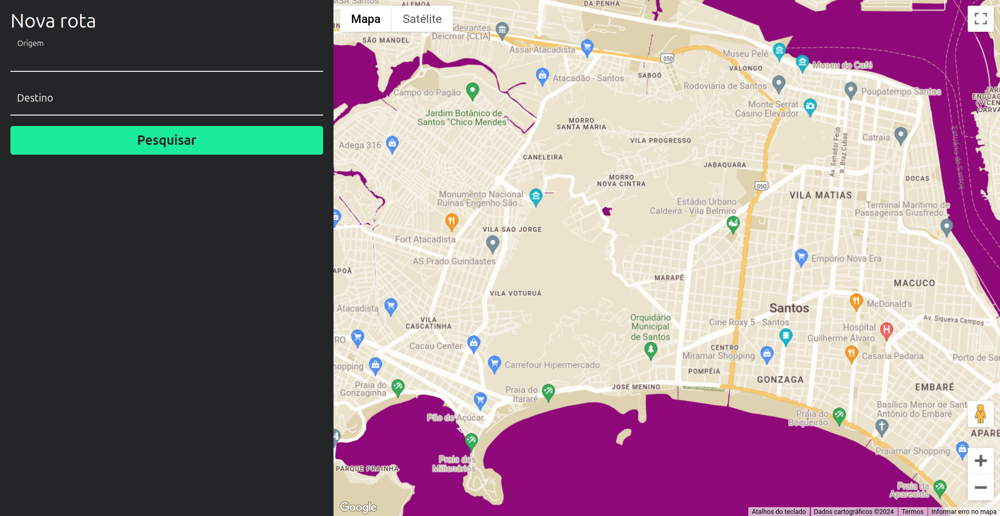

# TrackTafer - Vehicle tracking system & freight calculator with FullCyle

In this project, following [Full Cycle's](https://github.com/devfullcycle) Immersion #20, I developed a step-by-step vehicle monitoring and freight calculation system, with real-time trip route simulation and integration with the Google Maps APIs.
It was built over a week of lessons, totaling more than 12 hours of dedication, following the instructors and solving problems on my own.

## Tecnologias utilizadas e infraestrutura

- **Nest.js** as REST API.
- **Golang** microsservice responsible by vehicle simulation.
- **Next.js** for front-end with SSR.
- **Apache Kafka** for messaging.
- **WebSocket/Socket.io**.
- **MongoDB** as database and **Prisma** as ORM.
- **Docker with Docker Compose**.

## Front-End view example



## Requirements & Run application

Using Docker, you can run the whole application with Docker Compose.

```bash
docker-compose up -d
```

This command will start all the necessary containers to run the entire project.

Access the `golang-microservice`, `nest-api`, and `next-frontend` folders and follow the instructions.
